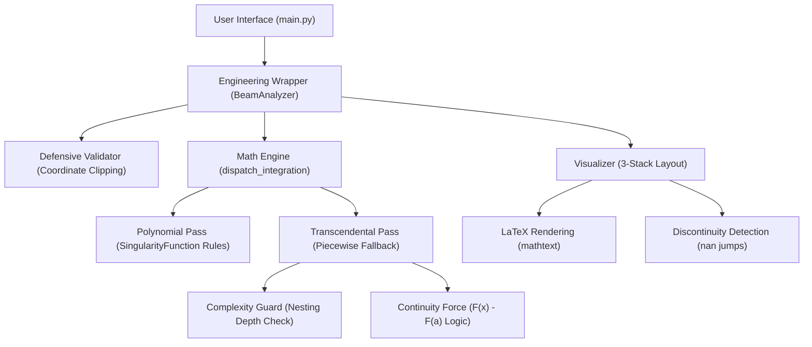
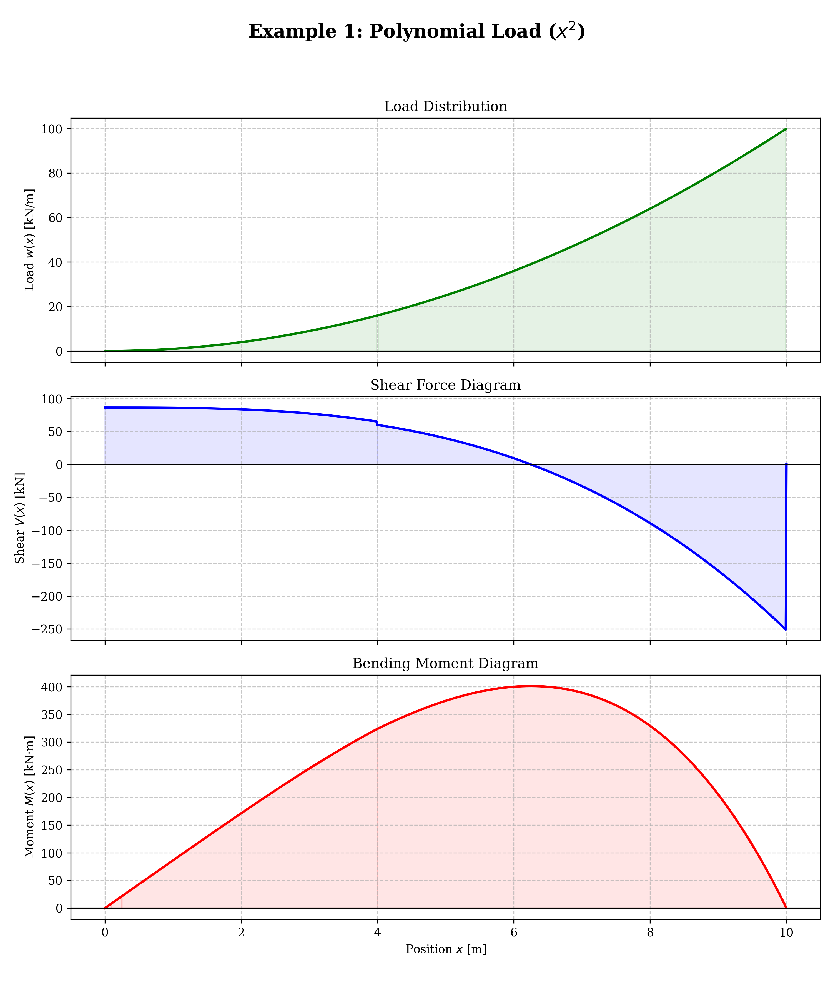
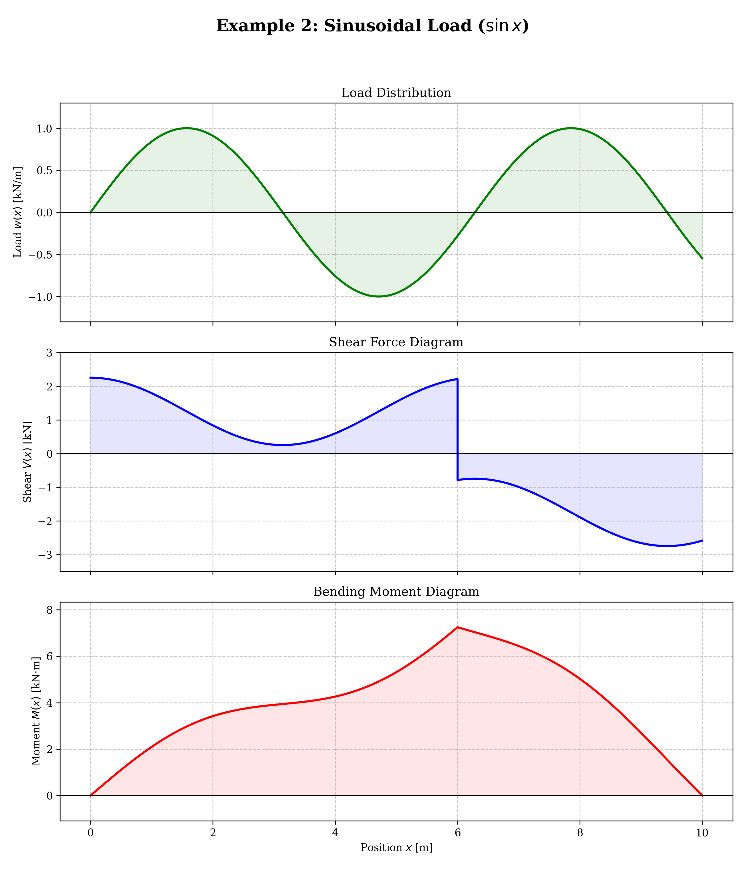
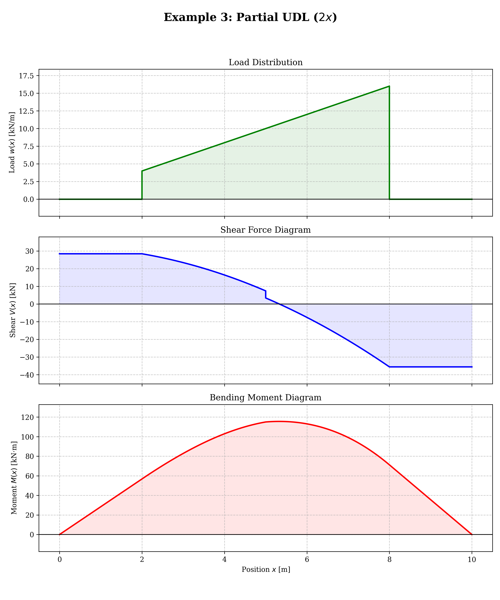
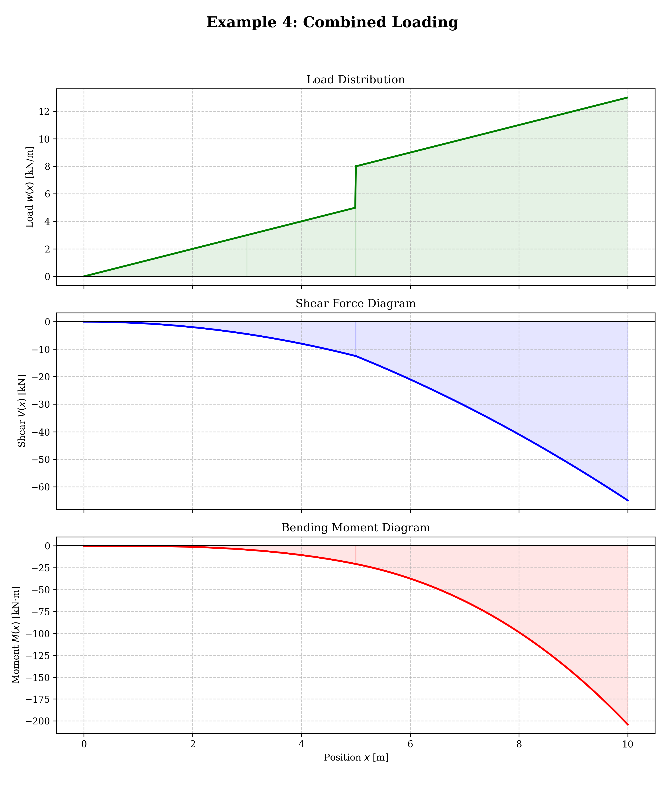

# Beam-Demo: GSoC 2026 Production-Ready Beam Analyzer

[](https://www.sympy.org/)
[](https://summerofcode.withgoogle.com/)

## Overview
A high-fidelity symbolic beam analysis engine designed for GSoC 2026. This prototype implements a **"Smart Dispatcher"** integration logic that bridges the gap between SymPy's `SingularityFunction` and complex transcendental loads ($\sin, \cos, \exp, \log$), ensuring exact symbolic results and $C^0$ continuity in Bending Moment Diagrams (BMD).

## Technical Architecture

The system is built on a clean separation between the mathematical core and engineering abstractions:



### Key Features
- **Smart Dispatcher**: Automatically detects transcendental functions and falls back to a robust Piecewise integration engine.
- **Symbolic Robustness**: Handles symbolic constants ($L, E, I$) and positions ($kL$) without requiring numerical values.
- **Physical Validation**: Defensive checks to ensure loads are situated within the beam's physical length.
- **Visual Excellence**: Professional-grade 3-stack plots with LaTeX labels and vertical jumps at point loads.

## Repository Structure
```text
.
├── beam_analyzer.py      # Engineering Wrapper & Support Solver
├── singularity_logic.py  # Math Engine (The Smart Dispatcher)
├── visualizer.py         # Visual Excellence Module (Plotting)
├── test_suite.py         # Pytest regression & stress tests
├── main.py               # Main demo script
├── DESIGN_DOC.md         # Detailed architectural documentation
├── docs/gallery/         # Automated high-quality plot export
└── requirements.txt      # Project dependencies
```

## Quick Start

1. **Install dependencies**:
   ```bash
   pip install -r requirements.txt
   ```
2. **Run the Test Suite**:
   ```bash
   pytest test_suite.py
   ```
3. **Generate the Gallery**:
   ```bash
   python main.py
   ```

## Gallery 
*Automatically generated by the Visual Excellence Module.*

| Case | Plot |
| :--- | :--- |
| **Example 1: Polynomial Load** |  |
| **Example 2: Sinusoidal Load** |  |
| **Example 3: Partial UDL** |  |
| **Example 4: Combined Loading** |  |

---
*Developed as a prototype for the SymPy community.*
