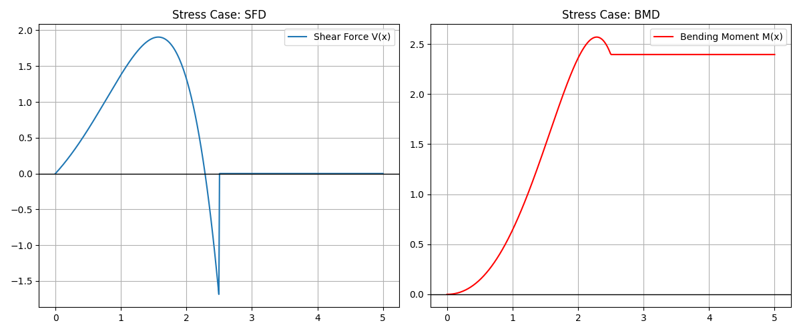

## Exact Symbolic Load Modeling Prototype

### Overview
This repository contains the Proof of Concept (POC) for enhancing the SymPy SingularityFunction core. It demonstrates a **Lazy-Rewrite & Fold** approach to integrating non-polynomial beam loads exactly.

### Key Features
- **Exact Integration**: Supports $\sin(x)$, $\cos(x)$, $\exp(x)$, and $\log(x)$ loads.
- **Boundary Continuity**: Implements $F(x) - F(a)$ logic to ensure zero-shear starts and $C^0$ continuity.
- **Hardened Engine**: Includes recursion guards and boundary validity checks for non-integrable functions.

### Project Files
- **singularity_logic.py**: Implements the refactored `xsingularityintegrate` dispatcher.
- **verify_integration.py**: Stress-tests the engine against symbolic boundaries (e.g., $L/2$).
- **beam_analyzer.py**: Core logic and `BeamAnalyzer` class using the exact integration approach.

### Repository Structure 
```text
.
├── beam_analyzer.py      # Core logic and BeamAnalyzer class
├── singularity_logic.py  # Standalone Exact Integration Engine
├── verify_integration.py # Stress-test and Boundary POC script
├── main.py               # Main demo script with 4 examples
├── requirements.txt      # Project dependencies (sympy, matplotlib, numpy)
├── stress_case_plot.png  # Generated plot for the POC Stress Case
├── screenshots/          # Standard generated plots for documentation
│   ├── example1.png
│   ├── example2.png
│   ├── example3.png
│   └── example4.png
└── .gitignore            # Excludes environment and cache files
```

### Quick Start 
1. **Install dependencies**:
   ```bash
   pip install -r requirements.txt
   ```
2. **Run the POC Stress Test**:
   ```bash
   python verify_integration.py
   ```
3. **Run the Main Demo**:
   ```bash
   python main.py
   ```

### Examples & Results 

#### Example 1: Polynomial Distributed Load
Load: $w(x) = x^2$ from 0 to 10.


#### Example 2: Trigonometric Distributed Load
Load: $w(x) = \sin(x)$ from 0 to 10.


#### Example 3: Partial Distributed Load
Load: $w(x) = 2x$ from $x=2$ to $x=8$.


#### Example 4: Multiple Loads
Multiple distributed and point loads combined.


Successfully integrated **$\cos(x)\exp(x)$** over $[0, L/2]$ with symbolic result simplification and boundary continuity enforcement.


