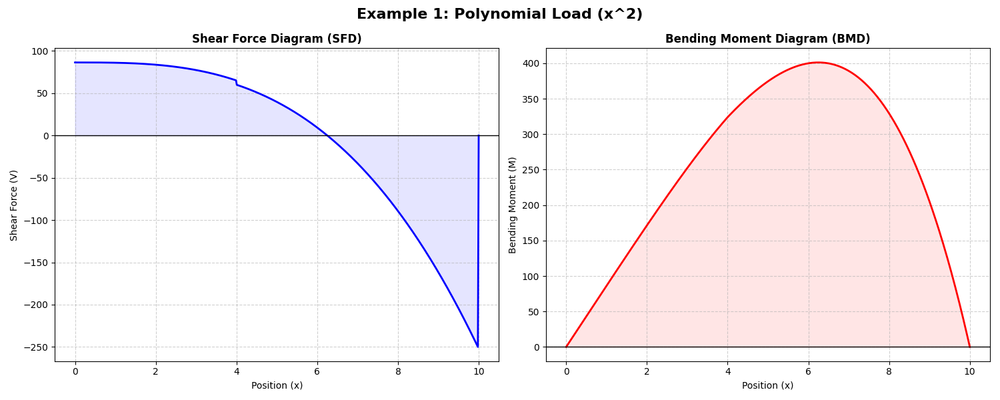
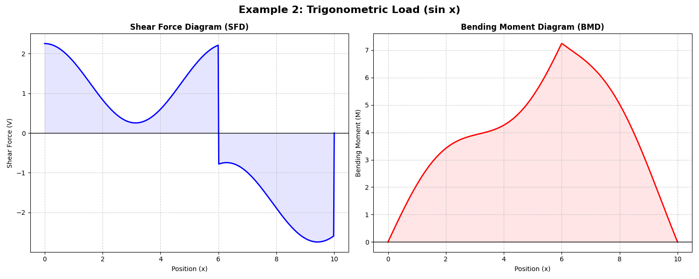
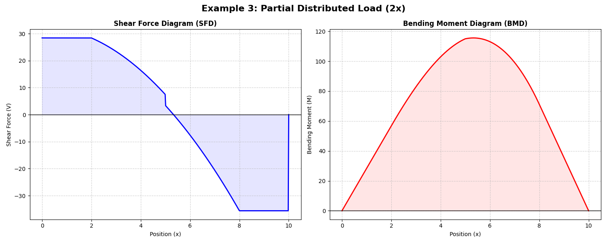
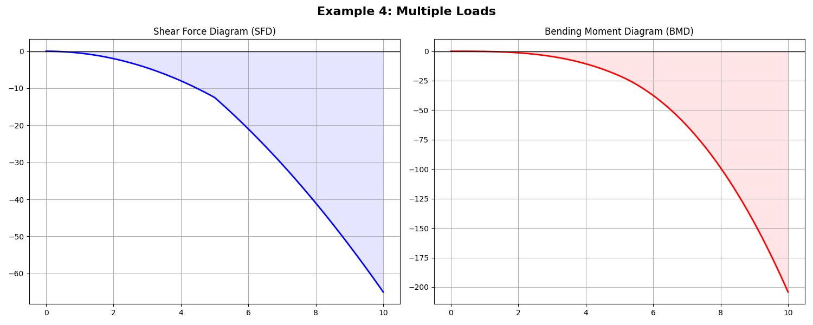

# Beam Analyzer 

BeamAnalyzer is a high-performance Python framework designed for the symbolic analysis of structural members. By leveraging the SymPy computer algebra system, it provides exact analytical solutions for shear, moment, and deflection, even under complex transcendental or polynomial loading conditions.

## Features 

- **Exact Symbolic Engine**: Utilizes SymPy to generate closed-form expressions for Reaction Forces, Shear Force (SFD), and Bending Moment (BMD).
- **Arbitrary Loading Profiles**: Native support for complex load functions, including:<br>
         - Polynomials: w(x) = ax^n + bx^{n-1} ... <br>
         - Trigonometric: w(x) = sin(k . x) <br>
         - Piecewise/Partial: Discontinuous loads defined over specific intervals.<br>
- **Side-by-Side Visualization**: High-quality plots for Shear Force Diagrams (SFD) and Bending Moment Diagrams (BMD).
- **Optimized Poly-Solver**: Custom implementation for decomposing polynomial loads into Singularity Functions, drastically reducing computation time for high-degree distributions.
- **Engineering Insights**: Automated interpretation layer that identifies critical points (max/min moments) and inflection points.
  
## Repository Structure 

```text
.
├── beam_analyzer.py      # Core logic and BeamAnalyzer class
├── main.py               # Main demo script with 4 examples
├── requirements.txt      # Project dependencies (sympy, matplotlib, numpy)
├── screenshots/          # Generated plots for documentation
│   ├── example1.png
│   ├── example2.png
│   ├── example3.png
│   └── example4.png
└── .gitignore            # Excludes environment and cache files
```

## Quick Start 🛠️

1. **Install dependencies**:
   ```bash
   pip install -r requirements.txt
   ```

2. **Run the demo**:
   ```bash
   python main.py
   ```

## Examples & Results 

### Example 1: Polynomial Distributed Load
Load: $w(x) = x^2$ from 0 to 10.


### Example 2: Trigonometric Distributed Load
Load: $w(x) = \sin(x)$ from 0 to 10.


### Example 3: Partial Distributed Load
Load: $w(x) = 2x$ from $x=2$ to $x=8$.


### Example 4: Multiple Loads
Multiple distributed and point loads combined.


## Technical Implementation 

The core logic utilizes the Singularity Function method from sympy.physics.continuum_mechanics.

Traditional numerical solvers often suffer from rounding errors in complex beam configurations. BeamAnalyzer bypasses this by maintaining symbolic integrity throughout the integration process. 

# Optimization Note
In SymPy 1.14+, Symbolic integration of hight-degree polynomials can be computationally expensive. This prototype implements a "Poly-Optimization" Layer that pre-processes loads into optiized singularity terms before they hit the solver.

---
Developed as a clean engineering prototype.
